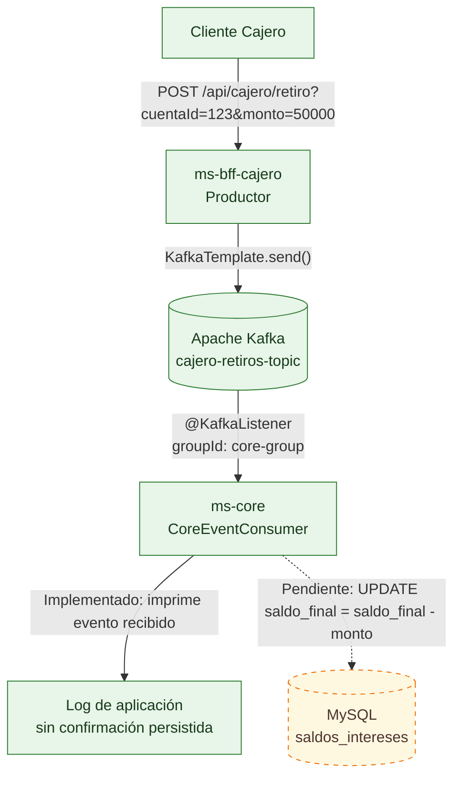

# Bank XYZ - Backend distribuido

Backend Java 21/Spring Boot 3.4.1 organizado como un reactor Maven con Config Server, Eureka, un servicio Core y tres BFF independientes. Se incluyen consultas síncronas al Core, seguridad JWT en el BFF Cajero y un flujo de retiros publicado en Kafka.

> Este README describe el estado actual del proyecto. En particular, el consumidor Kafka todavía no persiste el retiro en MySQL.

## Objetivos del proyecto

- Evolucionar la solución legacy hacia servicios Spring Boot independientes, con límites claros entre Core y los canales cliente.
- Adaptar las respuestas del backend a las necesidades de Web, Mobile y Cajero mediante BFFs separados.
- Centralizar la configuración de ejecución y habilitar descubrimiento de servicios con Spring Cloud Config y Eureka.
- Aplicar HTTPS y autenticación JWT al canal Cajero, y proteger las operaciones críticas con respuestas de error explícitas.
- Demostrar comunicación asíncrona con Kafka para el retiro de Cajero y documentar las piezas necesarias para completar su consistencia transaccional.

## Justificación del patrón Saga

Un retiro involucra al menos dos contextos desplegables: el BFF Cajero recibe la solicitud y el Core es responsable del saldo persistido. Mantener la llamada HTTP abierta hasta que Core procese la operación acoplaría la disponibilidad del canal a la del servicio de datos. La Saga por **coreografía** permite que cada participante reaccione a eventos sin un coordinador central: Cajero publica el retiro en Kafka y Core consume el evento de manera asíncrona.

Se elige coreografía para este flujo pequeño porque reduce el acoplamiento temporal y permite que BFF y Core escalen y fallen de forma más independiente. A cambio, el estado es eventualmente consistente y la lógica del proceso queda distribuida entre productores y consumidores; por eso deben definirse eventos de resultado, reintentos, idempotencia y compensaciones antes de usar el flujo para movimientos financieros reales.

En la implementación actual solo está resuelto el envío y consumo del evento. El listener todavía no actualiza el saldo ni publica confirmación o rechazo; el ejemplo es una base demostrativa de Saga, no una transacción distribuida completa.

## Arquitectura

| Módulo | Puerto | Responsabilidad |
|---|---:|---|
| `config-server` | 8888 | Publica configuración desde el repositorio nativo incluido en el classpath. |
| `eureka-server` | 8761 | Registro y descubrimiento de servicios. No se registra a sí mismo. |
| `ms-core` | 8081 HTTP | Endpoints internos, entidades/repositorios JPA y consumidor Kafka. |
| `ms-bff-cajero` | 8443 HTTPS | Login/JWT, consulta de saldo con Circuit Breaker y publicación asíncrona de retiros. También abre un conector HTTP local en `127.0.0.1:8080`. |
| `ms-bff-mobile` | 8444 HTTPS | Resumen móvil con conteo de transacciones del Core. |
| `ms-bff-web` | 8445 HTTPS | Dashboard web con historial del Core y DTO propio del BFF. |

Los BFF Web, Mobile y Cajero tienen clientes Eureka y Config Server. Las llamadas actuales a Core usan URLs directas a `localhost:8081`; no están usando balanceo de carga de Eureka.

## Estructura

```text
.
├── pom.xml                         # Agregador Maven (packaging pom)
├── docker-compose.yml              # Kafka; MySQL se ejecuta por separado
├── config-server/
│   ├── pom.xml
│   └── src/main/
│       ├── java/com/bancoxyz/config/ConfigServerApplication.java
│       └── resources/
│           ├── application.yml
│           └── config-repo/         # ms-core.yml y ms-bff-*.yml
├── eureka-server/
│   ├── pom.xml
│   └── src/main/java/com/bancoxyz/eureka/EurekaServerApplication.java
├── ms-core/
│   ├── pom.xml
│   └── src/main/
│       ├── java/com/bancoxyz/core/
│       │   ├── controller/          # API interna
│       │   ├── listener/            # Consumidor de retiros Kafka
│       │   ├── model/               # Entidades JPA
│       │   └── repository/          # Repositorios Spring Data
│       └── resources/application.yml
├── ms-bff-cajero/
│   ├── pom.xml
│   └── src/main/java/com/bancoxyz/cajero/
│       ├── config/                  # JWT, seguridad y conector HTTP local
│       ├── controller/              # Login y operaciones de cajero
│       ├── dto/
│       └── exception/               # Errores REST, incluido límite de intentos
├── ms-bff-web/
│   ├── pom.xml
│   └── src/main/java/com/bancoxyz/web/
│       ├── controller/
│       └── dto/                     # DTOs web; no importa entidades de Core
└── ms-bff-mobile/
    ├── pom.xml
    └── src/main/java/com/bancoxyz/mobile/{controller,dto}/
```

Cada servicio tiene su propio `pom.xml` y `src/main/resources/application.yml`. El Config Server usa `config-repo/` con archivos nombrados por `spring.application.name`.

## Requisitos y dependencias

- JDK 21.
- Docker con Docker Compose para Kafka.
- MySQL accesible en `localhost:3306`, con una base llamada `bancoxyz`.
- El repositorio incluye `mvnw` y `mvnw.cmd`; no hace falta instalar Maven globalmente.

El `docker-compose.yml` solo levanta Kafka, no MySQL. La configuración actual de desarrollo usa `root` / `admin`; adapta usuario y contraseña a tu instalación antes de iniciar Core.

```sql
CREATE DATABASE bancoxyz;
```

## Compilar y ejecutar

Desde la raíz del repositorio, valida o compila todo el reactor:

```powershell
.\mvnw.cmd validate
.\mvnw.cmd -DskipTests compile
```

Inicia Kafka y MySQL:

```powershell
docker compose up -d kafka
```

Kafka publica `localhost:29092` para clientes que corren en el host; dentro de la red Docker, su listener es `kafka:9092`.

Inicia cada comando en una terminal separada, en este orden recomendado:

```powershell
.\mvnw.cmd -pl config-server spring-boot:run
.\mvnw.cmd -pl eureka-server spring-boot:run
.\mvnw.cmd -pl ms-core spring-boot:run
.\mvnw.cmd -pl ms-bff-cajero spring-boot:run
.\mvnw.cmd -pl ms-bff-web spring-boot:run
.\mvnw.cmd -pl ms-bff-mobile spring-boot:run
```

### Inicio automatizado en Windows

Desde la raíz del repositorio, ejecuta el script incluido:

```powershell
.\iniciar_proyecto.bat
```

También puedes abrir `iniciar_proyecto.bat` desde el Explorador de archivos. El script ejecuta `docker compose up -d`, espera unos segundos y abre ventanas de consola para Config Server, Eureka, Core y los tres BFF. Al final deja la ventana inicial en pausa; revisa las consolas nuevas para confirmar que cada servicio inició correctamente.

Requisitos antes de ejecutarlo:

- Docker Desktop debe estar iniciado y el comando `docker compose` disponible.
- JDK 21 debe estar instalado y configurado.
- MySQL debe estar activo en `localhost:3306` y la base `bancoxyz` debe existir.


Los BFF importan Config Server como opcional (`optional:configserver:`), por lo que pueden iniciar con la configuración local si Config Server aún no está disponible. El registro en Eureka sí requiere que Eureka esté levantado.

## Configuración

| Servicio | Configuración destacada |
|---|---|
| Config Server | `src/main/resources/application.yml`; perfil `native`, puerto 8888, búsqueda en `classpath:/config-repo/`. |
| Eureka | `src/main/resources/application.yml`; puerto 8761, `register-with-eureka=false` y `fetch-registry=false`. |
| Core | Puerto 8081; MySQL `bancoxyz`; Kafka `localhost:29092`; registro en Eureka. |
| BFF Cajero | HTTPS 8443 con `keystore.p12`, alias `bancoxyz`; Kafka `localhost:29092`; Eureka; conector HTTP adicional en loopback 8080. |
| BFF Web | HTTPS 8445 con el keystore local; Eureka y Config Server opcional. |
| BFF Mobile | HTTPS 8444 con el keystore local; Eureka y Config Server opcional. |

Los archivos `ms-core.yml` y `ms-bff-*.yml` están en `config-server/src/main/resources/config-repo/`. El keystore está dentro de `src/main/resources` de cada BFF HTTPS. Las contraseñas del keystore y de MySQL incluidas en los YAML son valores de desarrollo: no las uses en producción.

**Nota de configuración Core:** en el `ms-core.yml` actual, `hibernate.ddl-auto` está indentado bajo `spring.datasource` en vez de bajo `spring.jpa`. Por ello, `spring.jpa.hibernate.ddl-auto=update` no se está aplicando desde esa configuración centralizada; revisa la indentación si esperas que Hibernate cree/actualice tablas.

## APIs

| Servicio | Método y ruta | Descripción |
|---|---|---|
| Cajero | `POST /api/auth/login` | Valida credenciales locales y entrega `{ "token": "..." }`. |
| Cajero | `GET /api/cajero/saldo` | Consulta saldo a Core; Circuit Breaker devuelve un fallback fijo si falla la llamada. |
| Cajero | `POST /api/cajero/retiro?cuentaId=123&monto=50000` | Publica el evento de retiro y responde sin esperar al consumidor. |
| Web | `GET /api/web/dashboard` | Obtiene historial del Core y lo transforma a `WebDashboardDTO`. |
| Mobile | `GET /api/mobile/resumen` | Obtiene del Core el conteo de transacciones. |
| Core | `GET /api/internal/core/saldo` | Saldo final de intereses, o `0.0` si no hay registros. |
| Core | `GET /api/internal/core/historial` | Lista de cuentas anuales. |
| Core | `GET /api/internal/core/transacciones/count` | Cantidad de transacciones. |

El Core escucha el tópico `cajero-retiros-topic`. Los endpoints Core usan HTTP en el puerto 8081; los BFF cliente usan HTTPS y el certificado local, por lo que `curl.exe` suele necesitar `-k` durante pruebas locales.

## Autenticación actual

El login JWT vive en `ms-bff-cajero` y sus usuarios de prueba están en memoria:

| Usuario | Contraseña | Rol |
|---|---|---|
| `cliente_web` | `web123` | `WEB` |
| `cliente_movil` | `movil123` | `MOBILE` |
| `cliente_cajero` | `cajero123` | `CAJERO` |

El token usa HS256 y expira en 15 minutos. La cadena de seguridad del BFF Cajero exige `ROLE_CAJERO` (rol `CAJERO`) para `/api/cajero/**`; el login y `/error` son públicos. La clave de firma está fija en el código y solo es apta para desarrollo.

De acuerdo con los requerimientos y el estado actual del proyecto, los POM de Web y Mobile no incluyen Spring Security/JWT (sus dependencias JWT están comentadas). Por lo tanto, esos dos BFF no validan los tokens ni aplican los roles `WEB`/`MOBILE` actualmente. Core tampoco configura autenticación para `/api/internal/core/**`; considéralo una API de red interna, no una frontera de seguridad pública.

Ejemplo para obtener un token de Cajero:

```http
POST https://localhost:8443/api/auth/login
Content-Type: application/json

{"username":"cliente_cajero","password":"cajero123"}
```


## Saga por coreografía: retiro de Cajero

El BFF Cajero actúa como productor, Kafka desacopla la solicitud y Core consume el evento. No hay un orquestador central. El tramo hasta el consumidor está implementado; la escritura del saldo que muestra la imagen de referencia todavía no existe en `CoreEventConsumer`.



El mensaje JSON publicado tiene esta forma:

```json
{"cuentaId":"123","monto":50000,"operacion":"RETIRO"}
```

**Estado de la saga:** el endpoint retorna “Transacción en proceso” tras publicar; el listener actualmente imprime el evento y no inyecta repositorios ni ejecuta un `UPDATE`. No hay evento de confirmación, manejo de errores de negocio, idempotencia ni acción compensatoria. Por ello, el retiro asíncrono es un esqueleto de coreografía, no una saga transaccional completa.

## Funcionalidades y límites conocidos

- BFF Cajero consulta saldo con Resilience4j Circuit Breaker. El fallback devuelve texto con saldo `0.0`; no consulta una caché real (Evolutivo de proyecto).
- `ApiExceptionHandler` convierte el límite excedido de operaciones del Cajero en HTTP 429 con un mensaje JSON. El contador es local al proceso y en memoria; se reinicia al reiniciar el servicio y no coordina réplicas.
- El retiro solo publica el evento Kafka; todavía no modifica `saldos_intereses`.
- Los tres BFF llaman a Core mediante URLs locales fijas, no mediante un cliente balanceado Eureka.
- `docker-compose.yml` no contiene MySQL; se necesita una instancia externa y la base `bancoxyz`.

